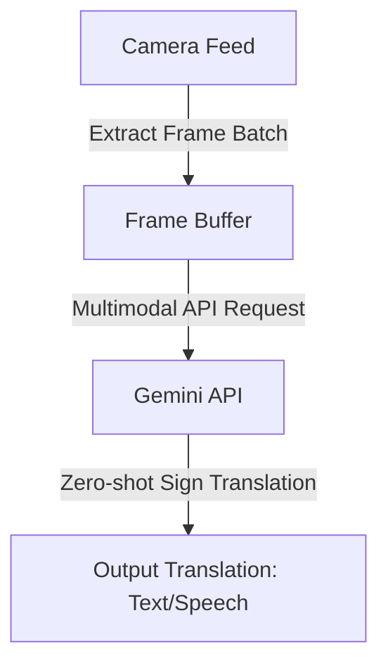

# 🤟 ISL Gemini — Multimodal Sign Language Interpreter

An innovative prototype design for real-time Indian Sign Language (ISL) video translation using the multimodal understanding of the Google Gemini API.

---

## 🚀 Conceptual Design & Flow

Instead of deploying local pose-estimation scripts, ISL Gemini sends video streams/frame buffers directly to the Gemini API (`gemini-2.5-flash` or `gemini-1.5-flash`), utilizing the model's natural ability to interpret video sequences and translate them directly into text.



---

## 🛠️ Tech Stack

* **Language**: Python 3.10+
* **Core API**: `@google/genai` (Google GenAI SDK)
* **Libraries**: OpenCV (for video/frame capture)

---

## 📦 Project Structure

```
isl-gemini/
├── translate_stream.py      # Main CLI stream translator prototype
├── .gitignore               # Ignored local files
└── README.md                # Project architecture & overview
```

---

## ⚙️ How to Run

1. **Clone the repository**:
   ```bash
   git clone https://github.com/Harshguliag416/isl-gemini.git
   cd isl-gemini
   ```
2. **Install packages**:
   ```bash
   pip install google-genai opencv-python pillow python-dotenv
   ```
3. **Configure Environment**:
   Create a `.env` file:
   ```env
   GEMINI_API_KEY=your_gemini_api_key_here
   ```
4. **Execute**:
   ```bash
   python translate_stream.py --source 0
   ```
